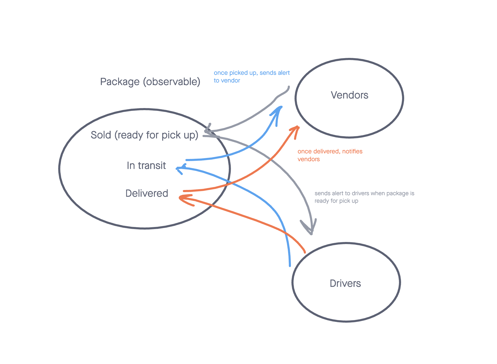

# caps

CAPS - The Code Academy Parcel Service, a system that emulates a real world supply chain. CAPS will simulate a delivery service where vendors (such a flower shops) will ship products using our delivery service and when our drivers deliver them, each vendor will be notified that their customers received what they purchased.

## Installation

* `npm install`

## URLs

- 
- [PR 1](https://github.com/KatKho/caps/pull/1)
- [PR 2](https://github.com/KatKho/caps/pull/2)
- [GitHub Actions](https://github.com/KatKho/caps/actions)
- [Deployed]()

## Contributors

- Ekaterina Khoroshilova
- ChatGPT has been utilized for tests
